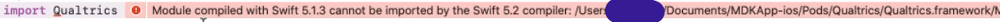

# Developing a Library

## From Inside Your App

---

## Dependency Managers

- CocoaPods
- Carthage
- Swift Package Mananger
- Gradle
- Maven
- Bundler
- RubyGems

---

### Don't Mix Dependency Managers

This includes manual dependency management!

---

## Source vs Binary Distribution

---

## Source Distribution

- Open Source
- Inner Source
- Details for build system
  - Language version
  - File paths
  - Dependencies

---

## Binary Distribution

- Pre-compiled `.jar` or `.aar` files
- iOS static library `.a` files
- iOS dynamic `.framework` files
- ✨ New `.xcframework` files

---

## Swift Module Stability

- Swift 5.1 (Xcode 11.0)
- `*.framework/*.swiftmodule/*.swiftinterface`

https://www.donnywals.com/what-is-module-stability-in-swift-and-why-should-you-care/

---

## Gradle

- Builds project modules from source
- External dependencies downloaded from Maven repository

---

## CocoaPods

- Typically used for source-based distribution
- Can be used with pre-built binaries

---

## CocoaPods Binaries

- `source = { "http => ... }`
- `vendored_frameworks`
- `vendored_libraries`

---

# iOS App + External Library Source
# 🍏

---

## CocoaPods Dependency Resolution

### Podfile

`pod 'LibName'`

---

## By Version

- Only stable option for a release
- Requires that `podspec` be "published"
- Uses `source`s listed in `Podfile` to search

---

## By Version Examples

### Fuzzy Version 🐻

`pod 'LibName', '~> 1.1'`

- Like '>= 1.1' + '< 2'

### Pinned Version 📌

`pod 'LibName', '1.1.1'`

- Same as '= 1.1.1'

---

## By Tag

`pod 'LibName', :source => 'git@github.kp.org:MDK/KPSecurity.git', :tag => '1.1.0'`

- 🤥 Same as version pinning, more verbose
- 😿 No option for fuzzy versioning

---

## By Branch

`pod 'LibName', :source => 'git@github.kp.org:MDK/KPSecurity.git', :branch => 'ben/feature'`

- 💥 Breaks when branch deleted
- ⁉️ Unexpected changes when branch updated

---

## By Path

`pod 'LibName', :path => '../LibNameFolder'`

- 💥 Most brittle option (don't check in)
- 💪🏻 Allows for local library development

---

## iOS Local Dev Setup

1. Clone Library
1. Update `Podfile` with relative path
1. Run `pod install`
1. `pod deintegrate`

---

## Clone Library

1. Decide where to put it
1. Sibling directory is easiest

---

## Update `Podfile` with relative path

---

## Run `pod install`

---

## `pod deintegrate`

- Not required
- Useful for resolving strange build issues

---

# 🍏 Develop 👩🏽‍💻

---

# 🍏 Pull Request

---

# Android App + External Library Source
# 🤖

---

## Gradle Files

- `settings.gradle`
- `build.gradle` (1+)
- `gradle.properties`
- `gradlew`

---

## Gradle Dependency Resolution

- Repositories
- Maven coordinates
- Version specifiers

---

## Composite project

- Configured in `settings.gradle`

---

## Android Local Dev Setup

1. Clone Library
1. Update `settings.gradle` with relative path

---

# 🤖 Develop 👨🏿‍💻

---

# 🤖 Pull Request
